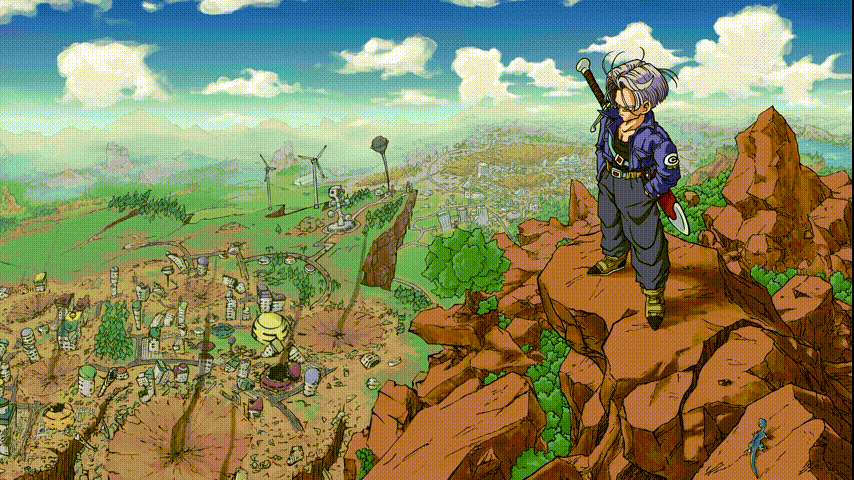

<blockquote>
  <strong>Trunks:</strong> "I've changed history for no reason."
</blockquote>

### Hey I'm Overseer!
I make the website go and the game play. I am a fullstack developer who enjoys adventure/psychological animes, especially one piece and code geass! I am living the college life and learning about security. A lot of my projects involve React and Lua!

 
 

say hi or human words u want here:
<a href="mailto:overseeruniverse@gmail.com">my email</a>

btw mudkip is my favorite starter
